# Photogrammetry Human Mesh Refinement

Automated Python pipeline for refining noisy photogrammetry-derived 3D human meshes.

## Overview

Photogrammetry is a low-cost way to reconstruct 3D human models from photographs, but when images are captured without professional scanners, the resulting meshes are often noisy, incomplete, and anatomically distorted. In many cases, these models require manual cleanup and smoothing in third-party software such as Blender or MeshLab, which can be time-consuming and usually requires prior experience.

This project explores an automated Python pipeline for cleaning and smoothing noisy photogrammetry-derived 3D human meshes, with the aim of reducing manual post-processing and making refinement more accessible to non-expert users.

## Current Status

The project was developed incrementally, starting from partial meshes before moving toward full-body processing.

At its current stage, the strongest results have been achieved on:

- isolated arm smoothing
- head smoothing
- facial landmark preservation
- full-body segmentation into anatomical regions
- body-part allocation from segmented clusters
- anthropometric marker and proportion extraction

The full end-to-end pipeline is still incomplete. In particular:

- torso and leg smoothing still require further testing
- body-part-specific smoothing logic still needs refinement
- merging individually smoothed parts back into one final refined full-body mesh has not yet been completed

## How It Works

The pipeline is organised into several stages:

### 1. Mesh segmentation
The input mesh is segmented into anatomical regions using saliency-based analysis, Laplacian eigen-decomposition, and clustering. These segments are then assigned to body parts such as the torso, arms, legs, and head using spatial heuristics.

### 2. Region-aware smoothing
Instead of applying one global smoothing operation to the whole body, each body region is processed independently. This helps reduce noise while avoiding unnecessary distortion of important anatomical structure.

### 3. Baseline comparison with general smoothing
As a baseline, the project also uses general Laplacian smoothing, similar to the kind of automatic smoothing available in tools such as Blender or MeshLab. This generic approach is useful for comparison, but it tends to flatten important anatomical detail.

### 4. Facial landmark locking
For the head region, 2D facial landmarks are detected from a front-facing image and used as anchor points during smoothing so that key facial features such as the eyes, nose, lips, and jawline remain more stable.

### 5. Proportion measurement
After refinement, the system extracts anthropometric body measurements such as shoulder width, chest depth, waist width, hip depth, and limb length using geometric rules based on detected body markers.

## Results

The current prototype demonstrates:

- successful smoothing of noisy arm meshes
- head refinement with better facial preservation than general smoothing
- segmentation of full-body meshes into anatomical regions
- body-part allocation from segmented clusters
- extraction of body markers, distances, and limb-length ratios

These results suggest that the pipeline can improve noisy photogrammetry outputs while remaining transparent, modular, and accessible. However, full-body smoothing and reconstruction into a single final refined mesh remain future work.

## Example Outputs

### Arm smoothing comparison

| Noisy arm mesh | General Laplacian smoothing | Custom smoothing method |
|---|---|---|
| 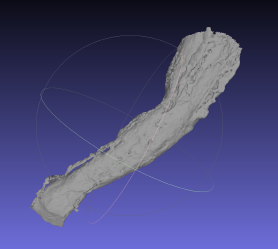 | 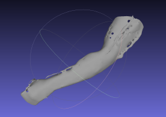 | 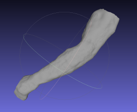 |

### Saliency analysis on noisy arm

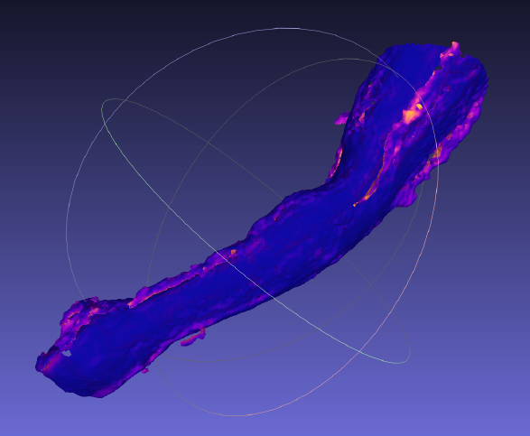

### Head smoothing comparison

| General Laplacian smoothing | Custom smoothing method |
|---|---|
| 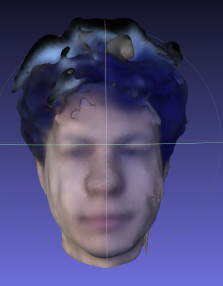 | 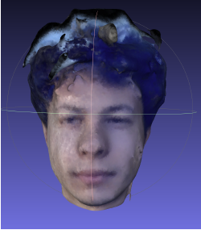 |

### Segmentation examples

| Example 1 | Example 2 |
|---|---|
| 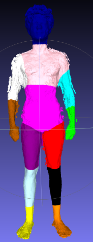 | 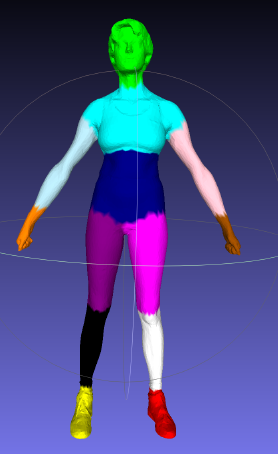 |

### Additional segmentation example

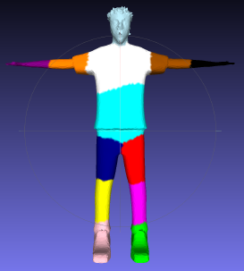

### Body-part allocation output

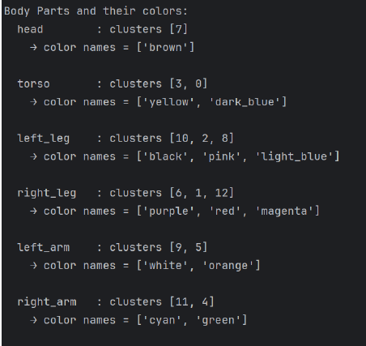

### Body measurement markers

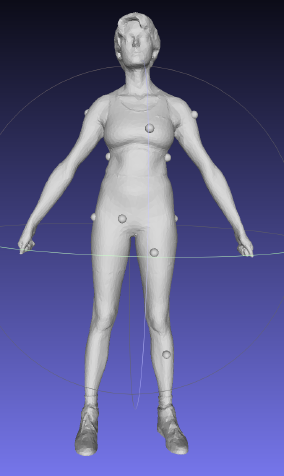

### Extracted measurements output

The reported distances and ratios are computed from detected body markers and region-based geometric measurements. The measurement regions are defined relative to total body height, which makes the method adaptable to different mesh scales.

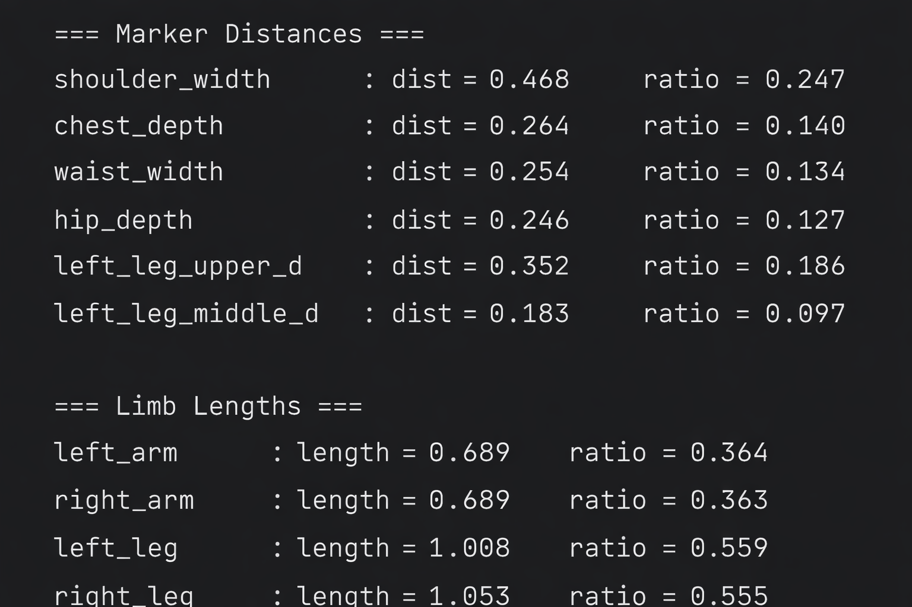

## Project Structure

```text
src/
  body_parts_allocation.py
  head_smoothing.py
  proportions.py
  segmentation.py
  smoothing_hand.py
  smoothing_model.py
images/
requirements.txt
